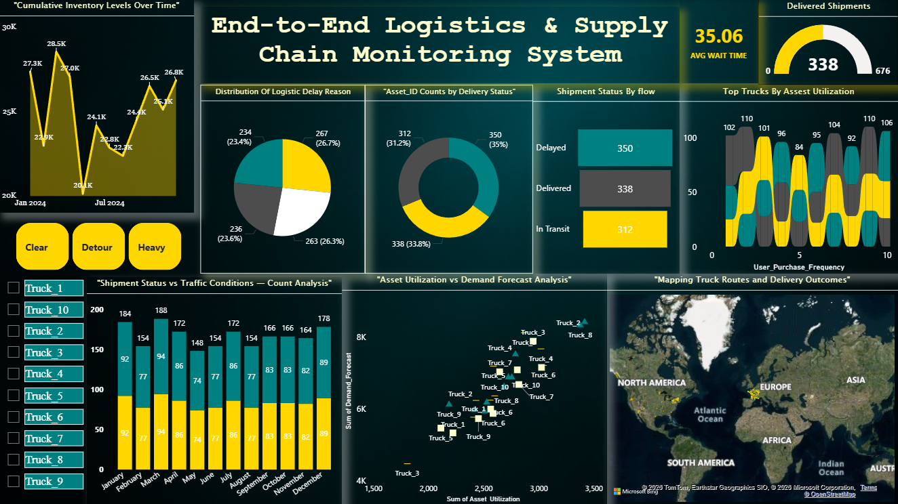

# 🚚 End-to-End Logistics & Supply Chain Monitoring Dashboard

## 📊 Dashboard Preview

## 📌 Description
An interactive **Power BI dashboard** designed to monitor and analyze end-to-end logistics and supply chain operations.  
The dashboard provides actionable insights into **shipment performance, inventory trends, asset utilization, delay reasons, and delivery outcomes**, enabling data-driven operational decision-making.

---

## 🧩 Project Overview
This project focuses on building a real-world logistics analytics solution that helps businesses:
- Track shipment delivery performance
- Identify bottlenecks and delay reasons
- Monitor inventory movement over time
- Analyze asset utilization against demand forecasts
- Visualize truck routes and regional delivery outcomes

---

## 📊 Key Features
- Shipment Status Analysis (Delivered, Delayed, In-Transit)
- KPI Cards (Average Wait Time, Total Deliveries)
- Inventory Trend Analysis (Monthly)
- Delay Reason Distribution
- Asset Utilization vs Demand Forecast
- Top Trucks by Asset Utilization
- Interactive Map for Truck Routes & Delivery Outcomes
- Slicers for Traffic Conditions and Truck Selection

---

## 🛠 Tools & Technologies
- **Power BI**
- **DAX**
- **Data Modeling**
- **CSV Dataset**
- **Business Intelligence & Data Visualization**

---

## 📁 Files Included
- `End-to-End_Logistics_Dashboard.pbix`
- `smart_logistics_dataset.csv`
- `dashboard-preview.png`

---

## 🎯 Business Use Case
This dashboard can be used by:
- Logistics Managers
- Supply Chain Analysts
- Operations Teams
- Business Decision Makers  

To improve delivery efficiency, reduce delays, and optimize asset utilization.

---

## 👤 Author
**Abrar Ahamed**  
Aspiring Data Analyst | Power BI | SQL | Python  

🔗 LinkedIn: *(add your LinkedIn profile link)*  
🔗 GitHub: *(this repository)*  
